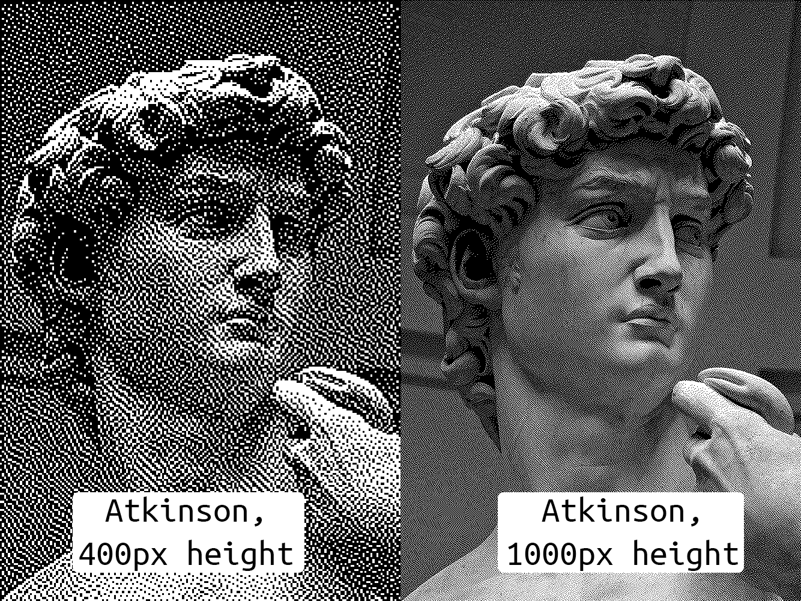

# Non-Square Dithering

Dither Studies is a series of non-indexical, non-representational dithers. The subject of the series is the dithering process itself. They are dithers of solid colors or gradients.

However, this presented a problem in moving to non-square pixels. Dithering was developed for our monitors, which have square arrangement of pixels, and so there is little reason for other patterns to be explored. An exception is Stephenson-Arce, a hexagonal dither kernel, designed for printer dots.

To find dithering kernels (the patterns) for other pixel shapes, I would have to dither 

I may get a little obsessive about ratios along the way

 David in Atkinson Dither, two scales

## What are kernels?

Dithering has a very different look in Floyd-Steinberg, the most widely-used dithering kernel, and Atkinson, a midtown-heavy and very distinctive dithering kernel in 

## Machine learning

Genetic algorithms are old school but they work incredibly well in distributed systems.

Sometimes it's tech that's no longer trendy that is the best to work with for a specific task. 

But that is what is so great at having these trends, they gove us many tools to pick from.